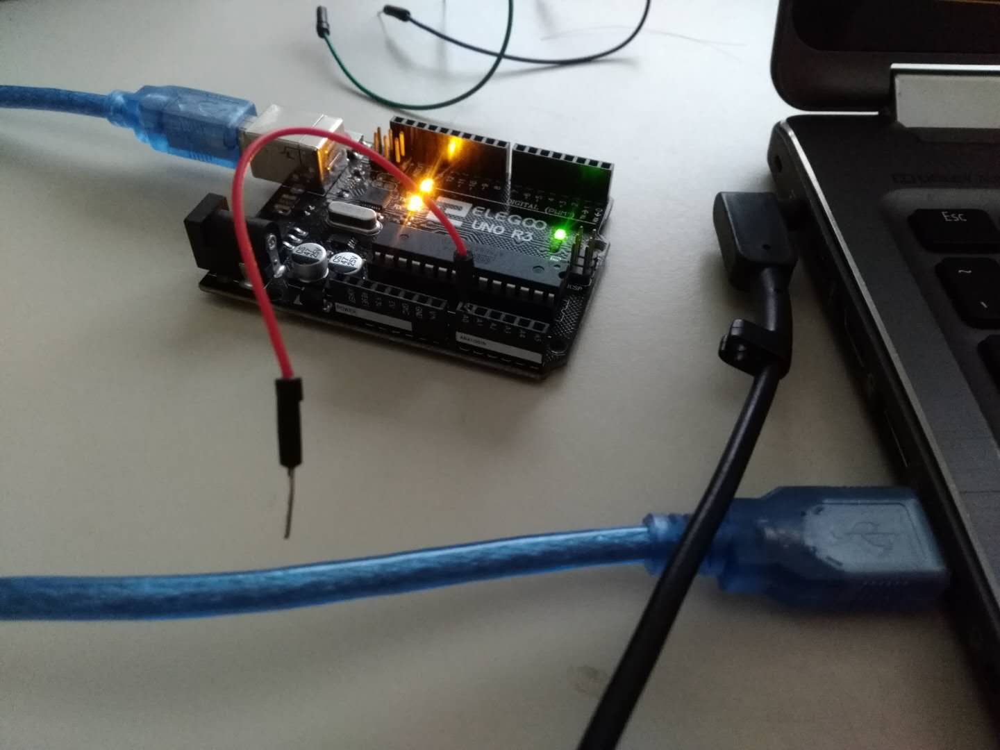
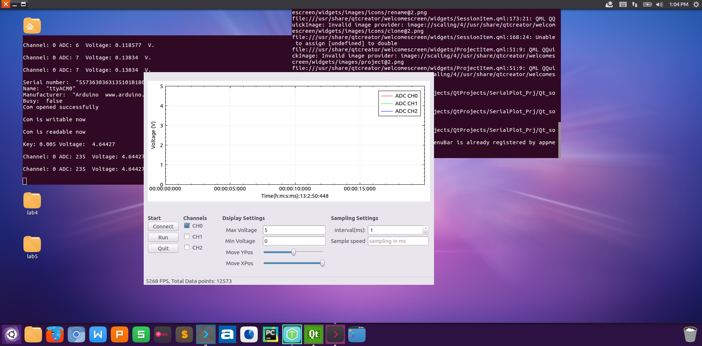
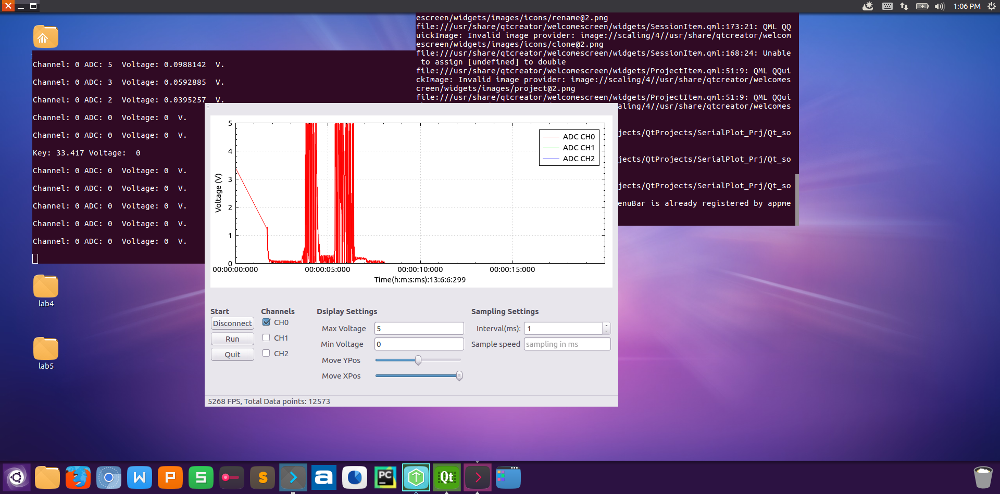
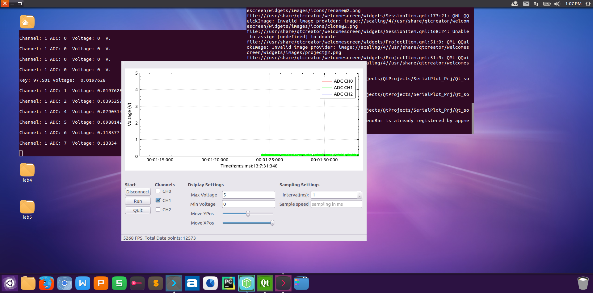
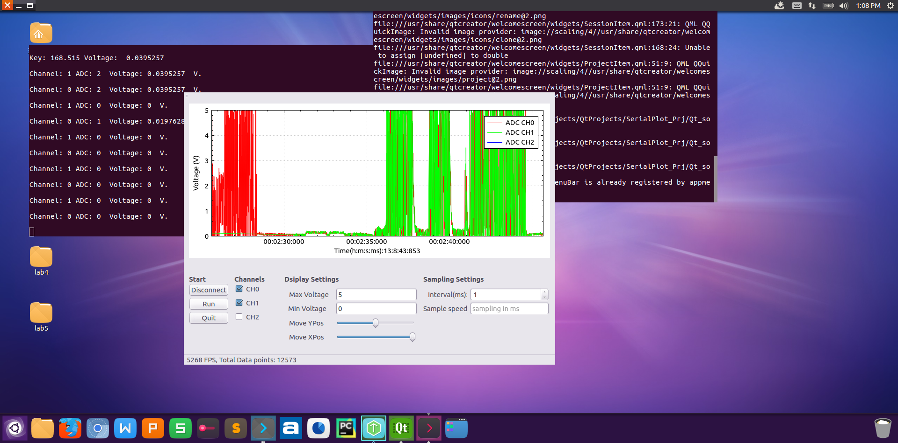
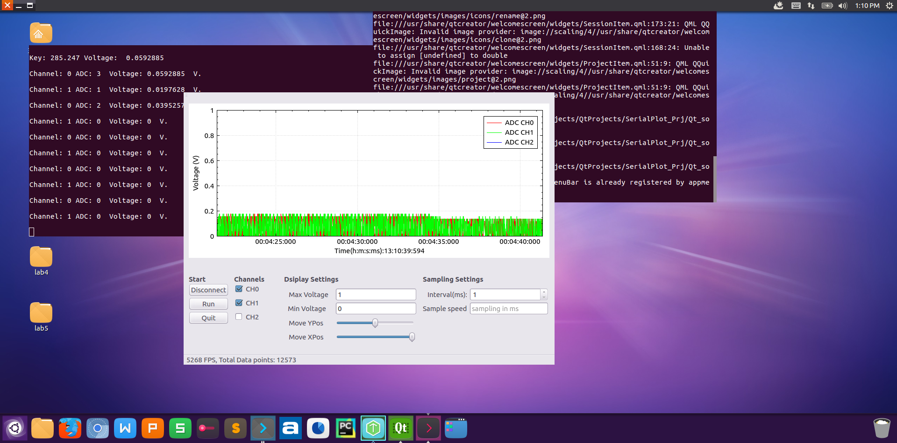

---

---

<h1 id="serial-plot">Serial Plot</h1>
<h2 id="introduction">1. Introduction</h2>
<ul>
<li>
<h3 id="purpose">Purpose</h3>
When doing some projects involving signal measurement such as voltage  signal, sensors’ data, we usually need an oscilloscope to visualize and analyize those data. However, such kind of devices are expensive for me.  Thus, why not develop an application using some cheap devices (Arduino for example) by myself?</li>
<li>
<h3 id="functions">Functions</h3>
In this project, i use an Arduino UNO board and Qt GUI platform to build a voltage viewer, where Arduino collects the voltage signal using ADC and sends the data by USART simply and QT GUI program manages and displays the dataset. 
In Qt GUI application, its functions are following:
<ul>
<li>ADC channel selection</li>
<li>Sample time selection</li>
<li>Axes range changing</li>
<li>Waveform review 
Note: this  application is based on Linux platform.</li>
</ul>
</li>
</ul>
<h2 id="setup">2. Setup</h2>
<h3 id="hardware-setup">2.1 Hardware setup</h3>

In this project, I simply use an Arduino board as  the hardware device to measure the analog signal. The following is a very simple image for hardware setup: 
 
There are 3 channels for analog signal sampling, CH0: pin A0, CH1: pin A1 and CH2: pin A2. 
In this test, i simply connect the CH0 pin

<h3 id="software-setup">2.2 Software setup</h3>
<h4 id="a.-open-the-software-you-will-see-this-gui">a.	open the software you will see this GUI</h4>

<h4 id="b.-click-the-check-boxes-to-select-channels">b. Click the check boxes to select channel(s)</h4>

 
The following images show a test that when I use my finger to hold the measurement pin, the plot curve changes 

<h2 id="usage">3. Usage</h2>
<h3 id="move-graph">3.1 move graph</h3>

To  move the graph along x axis or y axis, you can drag the “Move XPos”  or “Move YPos” slider bar to move the graph upward, downward, rightward and leftward.

<h3 id="change-maxmin-value-of-y-axis">3.2 Change max/min value of y axis</h3>

To change the maximum value or minimun value of the y axis (voltage axis), simply edit the values in edit area “Max Voltage” or “Min Voltage” to modifty the range of y axis

<h3 id="change-sampling-speed">3.3 change sampling speed</h3>

The sampling speed of the software can be changed by edit the value in “sample speed”. Note: the unit of value is in millisecond

<h3 id="change-time-axis-interval">3.4 change time axis interval</h3>

“interval(ms)” option in the GUI can be used to change the step value on the x axis and the unit is in millisecond (ms). The range of this value is from 1 to 60000 (1 minute)

A video for demonstrating this software can be found <a href="https://youtu.be/XiztBBY-jrM">here</a>

<h2 id="improvement">4. Improvement</h2>

In this software, there are still many places to optimize.

<ol>
<li>The function of reviewing the previous waveform can be updated by dragging the graph instead of using 2 slider bars.</li>
<li>The real-time property can be improved by updating the hardware program or using more advanced devices.</li>
<li>Sampling method can be extended. Trigger mode, real-time sampling, equivalent-time sampling can be added.</li>
<li>more 
If you are interested in this or want to improve my program, please feel free to commit in this project or contact me by email: <a href="mailto:wenkanw@g.clemson.edu">wenkanw@g.clemson.edu</a></li>
</ol>

